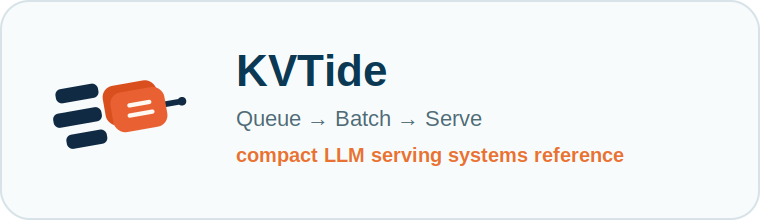
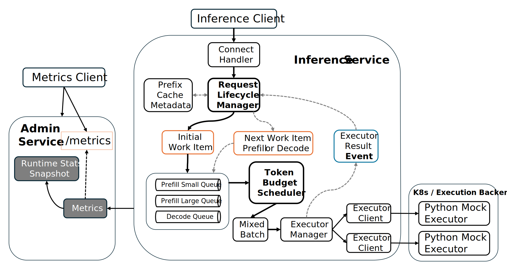
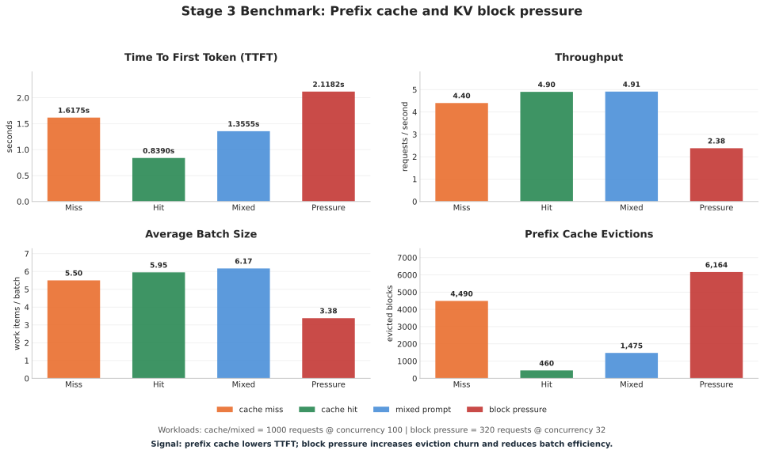

# Mini LLM Serve

<p align="center">
  
</p>

<p align="center">
  
  
  
  
  
</p>

<p align="center">
  <strong>A Go-based LLM serving control plane for token-aware scheduling, streaming observability, prefix cache, and KV block-aware inference experiments.</strong>
</p>

<p align="center">
  <a href="./README_zh.md">中文</a>
  ·
  <a href="./docs">Docs</a>
  ·
  <a href="#quick-start">Quick Start</a>
  ·
  <a href="./docs/benchmarks/stage3_en.md">Benchmark Report</a>
</p>

---

## What This Is

`mini-llm-serve` isolates the scheduling and control-plane layer of LLM serving.

It turns each inference request into lifecycle-managed prefill/decode work, schedules work by token budget, streams generated tokens, tracks TTFT/TBT separately, and models prefix-cache/KV-block behavior with reproducible benchmarks.

It is not a model runtime and does not try to replace vLLM, SGLang, TensorRT-LLM, llama.cpp, or Ollama. The execution backend is intentionally mocked in Python so the Go serving control plane can be inspected, tested, and evolved without requiring a GPU.

The project is designed to make these serving questions visible:

- How does a request move through prefill, decode, streaming, and cleanup?
- Why is `Request != WorkItem` in an LLM serving system?
- How do token budgets change batching behavior compared with request-level FIFO?
- How do TTFT and TBT expose different bottlenecks?
- What does prefix cache save, and what does it not save?
- How does KV block pressure affect batching efficiency and cache churn?

## What It Implements

| Area | Current implementation |
|---|---|
| API | Connect RPC inference service, streaming generation, admin endpoints |
| Request lifecycle | Go state machine for queued, prefill, decode, finished, timeout, canceled, failed |
| Scheduling | prefill/decode separation, token budget, small/large prefill queues, mixed batches |
| Execution | executor manager dispatching batches to Python mock inference executors |
| Streaming | unary and server-streaming generation paths with chunk-level metrics |
| Tokenization | mock tokenizer that converts prompt text into stable token IDs |
| Prefix cache | per-user cache salt, full-block hash matching, hit/miss/saved-token metrics |
| KV block model | block table, free queue, cached blocks, eviction counters, allocation failure metrics |
| Observability | Prometheus metrics for queue wait, execution time, TTFT, TBT, batch size, work items, KV blocks |
| Benchmarks | quick regression profile and report profile for cache miss, cache hit, mixed prompt, block pressure |

## Architecture

Mini LLM Serve uses token-aware work scheduling. A request is a lifecycle object; prefill and decode are separate schedulable work items.



The core loop is:

```text
GenerateRequest
  -> tokenizer
  -> Request lifecycle manager
  -> prefix cache lookup
  -> prefill/decode WorkItem
  -> token budget scheduler
  -> ExecutorManager
  -> Python mock executor
  -> Event
  -> next WorkItem or final response
  -> KV block cleanup
```

Key boundaries:

- `Request` owns the user-visible lifecycle and final response.
- `WorkItem` is the unit that the scheduler can batch and dispatch.
- `Event` is executor output that advances the lifecycle state machine.
- `Scheduler` chooses mixed prefill/decode work under sequence and token budgets.
- `BlockManager` models prefix hits, block allocation, free-list reuse, and eviction.
- `ExecutorManager` abstracts backend executors from the scheduler.

## Benchmark Highlights

Benchmarks use a Python mock executor. Results should be read as **serving control-plane behavior**, not GPU inference performance.



Workloads:

- `cache_miss`: 1000 requests, concurrency 100, unique users
- `cache_hit`: 1000 requests, concurrency 100, 10 warmed cache users
- `mixed_prompt`: 1000 requests, concurrency 100, short/medium/long prompts
- `block_pressure`: 320 requests, concurrency 32, long prompts under KV block pressure

| Scenario | Throughput | Avg Latency | Avg TTFT | Avg TBT | Avg Batch | Prefix Hits | Tokens Saved | Evictions |
|---|---:|---:|---:|---:|---:|---:|---:|---:|
| `cache_miss` | 4.40 req/s | 22.693s | 1.6175s | 0.3010s | 5.50 | 0 | 0 | 4490 |
| `cache_hit` | 4.90 req/s | 20.380s | 0.8390s | 0.2791s | 5.95 | 1000 | 80000 | 460 |
| `mixed_prompt` | 4.91 req/s | 20.363s | 1.3555s | 0.2715s | 6.17 | 0 | 0 | 1475 |
| `block_pressure` | 2.38 req/s | 13.428s | 2.1182s | 0.1615s | 3.38 | 0 | 0 | 6164 |

Key observations:

- Prefix cache hit reduced average TTFT from `1.6175s` to `0.8390s`, about `48%`.
- Cache hit improved throughput from `4.40 req/s` to `4.90 req/s` by reducing prefill pressure.
- Block pressure reduced average batch size to `3.38` and increased cache evictions to `6164`, exposing KV churn.
- Queue wait stayed around `5ms`; end-to-end latency is dominated by lifecycle phase behavior and repeated decode steps.

Read the full report: [`docs/benchmarks/stage3_en.md`](./docs/benchmarks/stage3_en.md).

## Quick Start

### Docker Compose

```bash
docker compose up --build -d
```

This starts a one-to-one local topology:

```text
Go control plane -> Python mock executor
```

Available endpoints:

- inference service: `http://127.0.0.1:8800`
- admin / metrics: `http://127.0.0.1:8801`

Check the containers and metrics:

```bash
docker compose ps
curl http://127.0.0.1:8801/metrics
```

Follow service logs or stop the stack:

```bash
docker compose logs -f
docker compose down
```

### Run From Source

Start the Python mock executor:

```bash
cd llm_serve
make run
```

Start the Go server from the repository root:

```bash
make run
```

### Kubernetes With kind

Run the one-to-one Server/Executor topology in a local three-node Kubernetes
cluster:

```bash
make docker-build
make kube-start
make kube-forward
```

See [`k8s/README.md`](./k8s/README.md) for the topology, resource model,
verification commands, and rollout workflow.

### Run Benchmarks

```bash
make bench-quick
make bench-report
```

`bench-quick` is a fast behavioral regression profile. `bench-report` runs the full benchmark profile used for documentation.

## Project Layout

```text
cmd/
  bench/        benchmark CLI
  client/       simple client wrapper
  server/       Go serving process
internal/
  block/        KV block table, prefix matching, free queue, eviction model
  executor/     executor manager and Connect backend
  handler/      request admission and streaming output
  metrics/      Prometheus metrics and runtime stats
  model/        Request, WorkItem, Event, Batch, block metadata
  scheduler/    token-budget scheduler and prefill/decode queues
  state/        request lifecycle state machine
  tokenizer/    mock tokenizer
  transport/    Connect RPC transport handlers
llm_serve/      Python mock executor
proto/          protobuf API definitions
docs/           reports, plans, benchmark notes
k8s/            local Kubernetes manifests
```

## Scope Boundaries

This repository intentionally focuses on the serving control plane. It does not implement:

- CUDA kernels
- PagedAttention kernels
- FlashAttention kernels
- real GPU KV tensors
- tensor parallel communication
- production autoscaling
- full OpenAI API compatibility

Those belong to inference engines or production platforms. This project models the control-plane layer around inference execution: lifecycle, scheduling, streaming, cache metadata, KV block pressure, and observability.

## Related Systems

- [vLLM](https://github.com/vllm-project/vllm)
- [SGLang](https://github.com/sgl-project/sglang)
- [TensorRT-LLM](https://github.com/NVIDIA/TensorRT-LLM)
- [llama.cpp](https://github.com/ggml-org/llama.cpp)
- [Ollama](https://github.com/ollama/ollama)
- [Ray](https://github.com/ray-project/ray)
