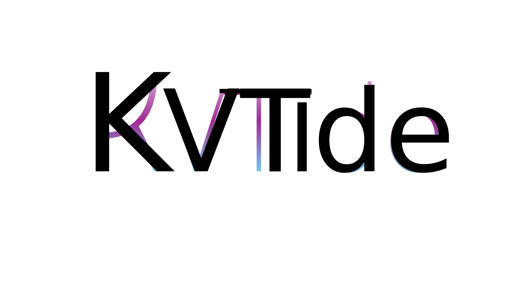
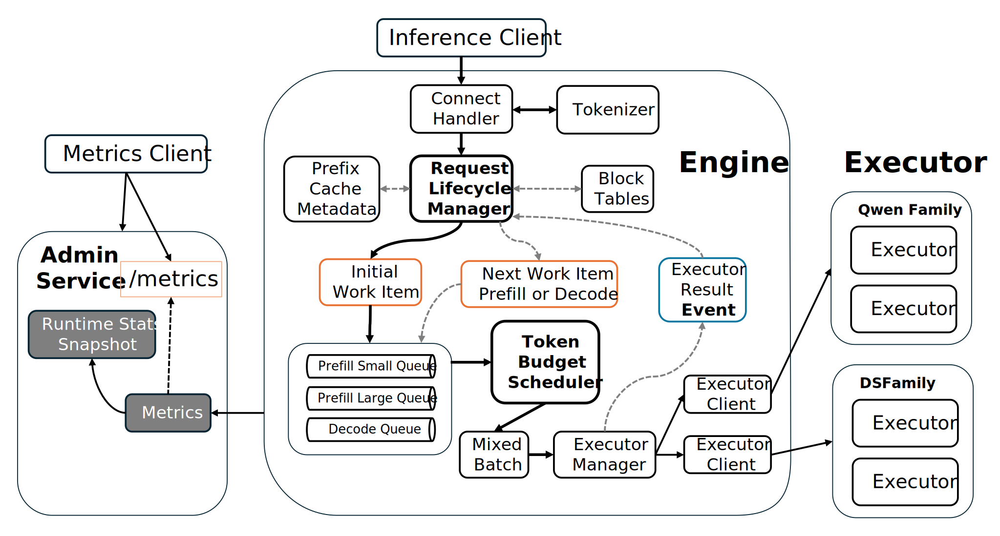
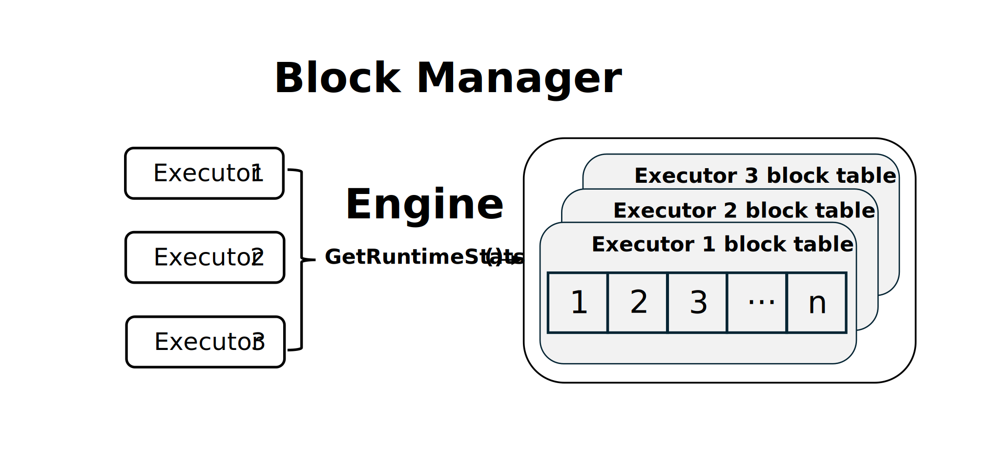
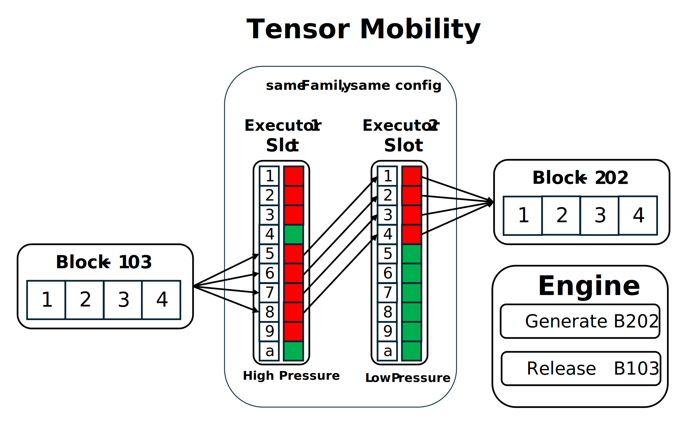
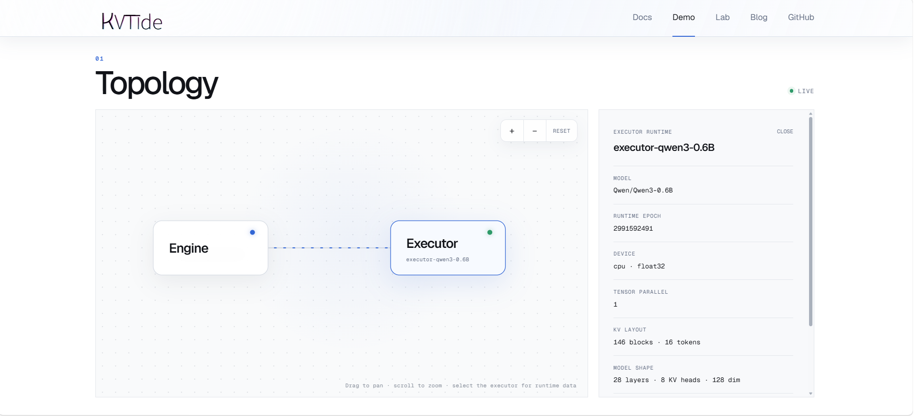

# KVTide


<p align="center">
  <strong>A Kubernetes-native scalable KV-aware LLM serving system, built from the runtime up.</strong>
</p>

<p align="center">
  
  
  
  
  
</p>

<p align="center">
  <a href="./README_zh.md">中文</a>
  |
  <a href="http://118.178.120.11:8802/">Documentation</a>  
  |
  <a href="#quick-start">Quick Start</a>
  |
  <a href="#architecture">Architecture</a>
  |
  <a href="./k8s/README.md">Kubernetes</a>
</p>

---

## What is KVTide?

KVTide is a scalable LLM serving system that makes scheduling and KV-cache ownership explicit. 

The Engine owns tokenization, requests lifecycle, scheduling, KV metadata. Executor owns model execution, local KV tensors.

## Vision
Cache-aware routing creates a tension: routing requests to the executor that already owns reusable KV state reduces recomputation, but it can also overload cache-hot executors and constrain scheduling decisions.

KVTide explores a different direction: move reusable KV state toward available compute, instead of always moving requests toward cached state.

## Ability In progress
| Capability                       | Status              |
| -------------------------------- | ------------------- |
| Executor-aware block ownership   | In progress         |
| Executor-to-executor KV transfer | Planned             |
| Proactive KV placement           | Research hypothesis |

## Architecture






## Protocol
The communication between Engine and Executor is using proto, see [protocol introduce](./proto/kvtide/v1/executor.proto)

## Quick Start

### With Qwen3-0.6B Executor

Download the model first:

```bash
cd executor
uv run hf download Qwen/Qwen3-0.6B --local-dir ./models/Qwen3-0.6B
cd ..

docker compose up --build -d
```

| Service | Address |
|---|---|
| Dashboard runtime console | `http://127.0.0.1:5173` |
| Inference API | `http://127.0.0.1:8800` |
| Admin API and metrics | `http://127.0.0.1:8801` |

```bash
docker compose ps
docker compose logs -f
curl http://127.0.0.1:8801/metrics
docker compose down
```

## Dashboard

- **Topology** discovers the connected executor and shows its status.
- **Metrics** reads Prometheus metrics for the whole system.
<p align="center">
  
</p>


## Kubernetes with kind

The Kubernetes manifests preserve the same one-to-one runtime topology:

```bash
make docker-build
make kube-start
make kube-forward
```

See [`k8s/README.md`](./k8s/README.md) for manifests, probes, rollout behavior, inspection commands, and cleanup.

The executor Deployment intentionally has one replica. Adding replicas behind a Kubernetes Service would load-balance batches without preserving executor-local KV ownership.

## Roadmap: From Ownership to Mobility

The next architectural boundary is executor-aware block ownership. Each block table must be scoped by executor and runtime epoch before the control plane can recover safely from restarts or place work across replicas.

From there, KVTide can evaluate its central hypothesis: when compatible executors run the same model weights, dtype, and tensor-parallel configuration, an overloaded executor should be able to **push** selected KV blocks to an available peer. The control plane should observe the new placement, update metadata, and measure whether reuse saved more work than transfer consumed.

That path requires evidence, not only functionality. Future evaluations should compare recomputation, local reuse, and remote transfer across TTFT, TBT, throughput, transfer bandwidth, cache pressure, and tail latency.

## Related Systems

- [vLLM](https://github.com/vllm-project/vllm): paged KV-cache management and continuous batching.
- [SGLang](https://github.com/sgl-project/sglang): prefix-aware scheduling and RadixAttention.
- [LMCache](https://github.com/LMCache/LMCache): reusable KV storage and movement across serving instances.
- Mooncake — KV-centric disaggregated serving and direct transfer.
- NVIDIA Dynamo — distributed inference orchestration and KV-aware routing.
- [llama.cpp](https://github.com/ggml-org/llama.cpp): lightweight local inference and CPU execution.


## License

[MIT](./LICENSE)
