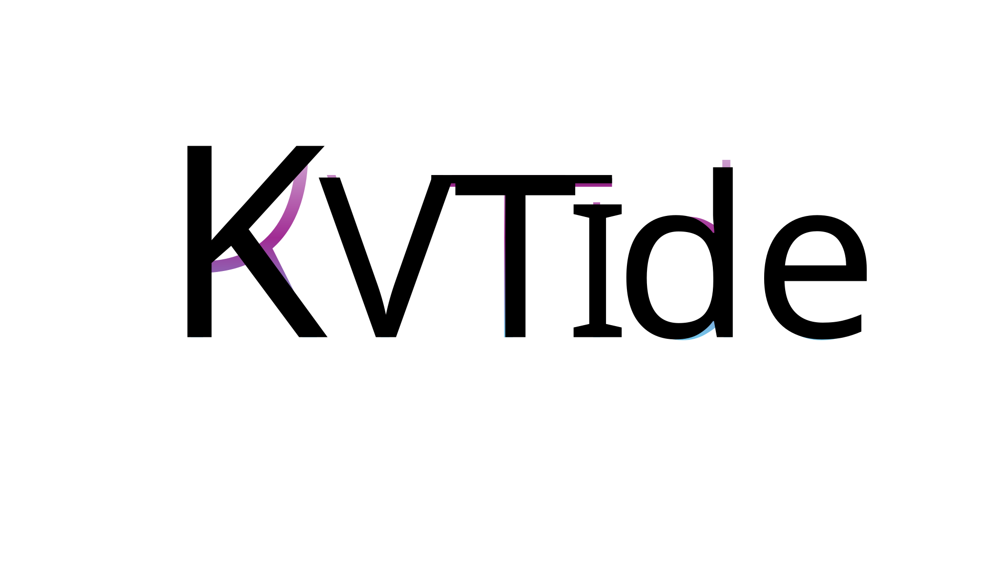
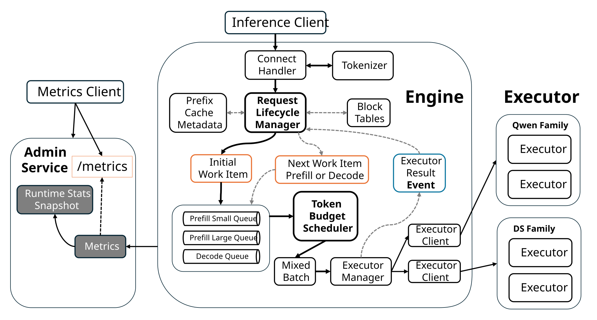

# KVTide

<p align="center">
  
</p>

<p align="center">
  <strong>An LLM-serving research prototype for KV ownership, prefix reuse, and cross-executor state transfer.</strong>
</p>

<p align="center">
  <a href="./README_zh.md">中文</a>
  ·
  <a href="#quick-start">Quick Start</a>
  ·
  <a href="#architecture">Architecture</a>
  ·
  <a href="./k8s/README.md">Kubernetes</a>
</p>

> **Project status: frozen.** KVTide has completed its current research exploration. It is no longer under active development as a paper project or production serving system. The repository remains available as a working experimental runtime and engineering artifact; it has no active placement-policy roadmap.

## What is KVTide?

KVTide makes several pieces of normally runtime-internal serving state explicit:

- The Go Engine owns tokenization, request lifecycle, scheduling, Executor runtime metadata, and KV block metadata.
- Python Executors own model execution, device-resident paged KV tensors, and KV block export/import.
- Each Executor has its own block table, work queue, and runtime epoch.
- The Engine can execute an explicit KV replication transaction between compatible Executors.

The project originally investigated whether hot prefix KV should be moved proactively toward available compute. As the surrounding serving ecosystem matured, that question no longer justified expanding a separate inference runtime. KVTide therefore stops at a mechanism-correctness prototype rather than adding prediction policies, a complete inference backend, or a production control plane. The archived research question and stopping rationale are in [`RESEARCH_QUESTION.md`](./RESEARCH_QUESTION.md).

## Implemented capabilities

| Area | Implementation |
|---|---|
| Requests and scheduling | Streaming request lifecycle, prefill/decode work items, chunked prefill, mixed work batches, sequence/token budgets |
| Multiple Executors | Runtime discovery plus per-Executor work queues and block registries |
| Prefix cache | User-scoped cache salt, chained full-block hashes, prefix matching, references, and release |
| KV block lifecycle | Allocation, reservation, commit, rollback, cache retention, and release |
| Model execution | Mock Runner and a Transformers-based Qwen causal-LM Runner on CPU or CUDA |
| Paged KV | Executor-side paged K/V tensors, physical-slot writes, and a Hugging Face `DynamicCache` adapter |
| KV transfer | Engine prepare → source push → destination import → Engine commit/rollback |
| Compatibility and stale-state rejection | Runtime epoch, loaded-weight fingerprint, KV layout version, and dtype/geometry/config compatibility fingerprint |
| Interfaces and observability | Connect RPC, incremental output, Prometheus metrics, and runtime inventory |
| Deployment | Docker Compose, a Web runtime console, and kind manifests |

## Architecture



Request execution:

```text
client
  -> Go Engine
     -> request state machine
     -> executor-scoped scheduler
     -> executor-scoped block registry
     -> ExecuteBatch
  -> Python Executor
     -> model forward
     -> local paged KV tensors
  -> event / streamed result
```

KV replication:

```text
Engine Coordinator
  -> reserve destination blocks and pin source blocks
  -> TriggerKVPush(source)
  -> source exports selected complete blocks
  -> PushKV(destination)
  -> destination validates identity, epoch, and compatibility
  -> destination imports K/V and confirms device completion
  -> Engine commits destination prefix metadata

failure
  -> Engine rollback
  -> release source pins and destination reservations
```

The Engine computes prefix hashes and passes them through the transaction. Executors do not independently derive prefix identity. Physical block IDs remain Executor-local; the destination imports data into locally reserved blocks.

## Validated scope

The Go and Python unit suites cover scheduling, block lifecycle, runtime epochs, compatibility checks, KV tensor round trips, RPC transfer, failure rollback, and inference reuse.

During development, a one-off integration run used two independent Executor processes on one RTX 4090 D to validate this path:

```text
source prefill
  -> Engine-triggered KV push
  -> destination prefix reuse
  -> output comparison with a full destination-side prefill
```

That experiment validated control flow and correctness. It was not a performance benchmark and establishes no multi-GPU or multi-node scaling result.

## Limitations

KVTide is a research prototype, not an alternative to vLLM, SGLang, or LMCache.

- KV transfer v1 synchronizes tensors to the host, encodes complete raw protobuf byte payloads, and copies them onto the destination device. It is not GPU Direct, RDMA, or NIXL.
- Each Executor serializes inference, release, snapshot, and import through one cache lock; there is no concurrent CUDA-stream overlap.
- A transfer is limited to 64 MiB by default and has no compression, chunked streaming, or incremental retry.
- Compatibility requires identical loaded weights, model configuration, dtype, KV geometry, layout version, and tensor-parallel size.
- Transfer v1 supports only `tensor_parallel_size=1` and complete prefix blocks starting at position zero.
- There is no placement policy, demand predictor, autoscaler, or proactive replication controller.
- There are no custom FlashAttention/PagedAttention kernels, tensor/pipeline/expert parallelism, or production-grade recovery mechanisms.
- The prototype establishes mechanism correctness, not throughput, tail-latency, or cost improvements.

## Quick Start

### Download the model and start the stack

The default Compose setup uses Qwen3-0.6B:

```bash
cd executor
uv run hf download Qwen/Qwen3-0.6B --local-dir ./models/Qwen3-0.6B
cd ..

docker compose up --build -d
```

| Service | Address |
|---|---|
| Web runtime console | `http://127.0.0.1:5173` |
| Inference API | `http://127.0.0.1:8800` |
| Admin API and metrics | `http://127.0.0.1:8801` |

```bash
docker compose ps
docker compose logs -f
curl http://127.0.0.1:8801/metrics
docker compose down
```

### Tests

```bash
go test ./...

cd executor
uv run python -m unittest discover -s tests -v
```

GPU environments may require a PyTorch wheel selected for the host driver. Use `uv run --no-sync` only when an already-provisioned environment must not be re-resolved; it is not the default local development command.

## Benchmarks and Kubernetes

`make bench-quick` and `make bench-report` use the Mock Executor to measure control-plane behavior, not GPU-kernel performance. Historical reports remain in [`docs/benchmarks`](./docs/benchmarks).

The kind manifests and commands are documented in [`k8s/README.md`](./k8s/README.md). They demonstrate the service topology; they do not constitute a production Operator or autoscaling system.

## Frozen boundary

KVTide does not plan to add:

- a proactive KV placement policy;
- generic cross-model KV transformation middleware;
- a full inference engine implemented in Go;
- GPU Direct or multi-node transport; or
- a production Kubernetes control plane.

If a new falsifiable question emerges from work on mature serving systems, this repository may be reused as a research harness. That is not an active roadmap or maintenance commitment.

## Related systems

- [vLLM](https://github.com/vllm-project/vllm)
- [SGLang](https://github.com/sgl-project/sglang)
- [LMCache](https://github.com/LMCache/LMCache)
- [llm-d](https://github.com/llm-d/llm-d)
- [TensorRT-LLM](https://github.com/NVIDIA/TensorRT-LLM)

## License

[MIT](./LICENSE)
