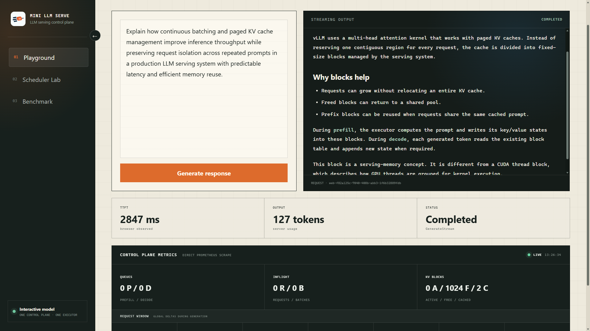
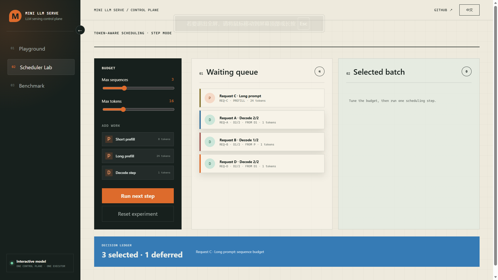

# KVTide

<p align="center">
  
</p>

<p align="center">
  
  
  
  
  
</p>

<p align="center">
  <strong>一个可交互的 LLM 推理控制平面，用于研究请求生命周期、token-aware scheduling、prefix cache、KV block 管理和流式推理。</strong>
</p>

<p align="center">
  <a href="./README.md">English</a>
  ·
  <a href="#快速开始">快速开始</a>
  ·
  <a href="#架构">架构</a>
  ·
  <a href="./k8s/README.md">Kubernetes</a>
</p>

---

## 项目定位

`kvtide` 聚焦现代 LLM serving 系统中的控制平面机制。

Go server 将每个推理请求拆分为可调度的 prefill 和 decode work，在 sequence budget 与 token budget 下构建 mixed batch，模拟 prefix cache 与 KV block metadata，并将生成结果流式返回客户端。Python executor 可以运行 mock runner，也可以运行 Qwen Transformers CPU runner。

这个项目用于观察和解释以下问题：

- 一个请求如何经历 queued、prefill、decode、streaming 和 cleanup？
- 为什么 `Request` 和 `WorkItem` 是不同的对象？
- token-aware batching 与 request-level FIFO 有什么区别？
- TTFT 和 TBT 分别反映什么 serving 行为？
- prefix-cache hit 实际节省了什么？
- KV block pressure 如何影响调度和 cache eviction？

它不是模型 runtime，也不替代 vLLM、SGLang、TensorRT-LLM、llama.cpp 或 Ollama。

## 交互界面

Web 界面会向 Go 控制平面发送真实的 Connect RPC 流式请求，渲染 Markdown 输出，显示浏览器观测到的请求指标，并直接抓取 Prometheus metrics，展示实时队列、KV block、cache、batch、work item 和延迟数据。



调度实验室会逐步展示一次调度过程。你可以调整 sequence 和 token budget，加入 prefill 或 decode work，然后观察哪些任务进入 selected batch、哪些任务继续留在 waiting queue。



第三个页面展示项目内置的 benchmark profile。

## 核心能力

| 方向 | 当前实现 |
|---|---|
| API | Connect RPC unary 与 server-streaming inference endpoints |
| 请求生命周期 | 状态机管理 queued、prefill、decode、finished、timeout、canceled 和 failed |
| 调度 | prefill/decode 独立队列、长短 prefill 分类、mixed batch、sequence 和 token budget |
| 执行 | 一个 Go 控制平面连接一个 Python executor |
| Streaming | 增量响应 chunk，并记录 TTFT、TBT、usage 和 finish reason |
| Prefix cache | per-user cache salt、完整 block hash 匹配、hit/miss 和 saved-token metrics |
| KV block model | block table、free-list reuse、cached blocks、allocation failure 和 eviction counter |
| 可观测性 | Prometheus metrics 与 runtime statistics，覆盖队列、batch、请求、延迟和 KV block |
| Web 界面 | 请求体验、调度实验室和 benchmark 页面 |
| 部署 | Docker Compose 和基于 kind 的本地 Kubernetes manifests |

## 快速开始

推荐使用 Docker Compose 启动完整项目：

```bash
cd executor
uv run hf download Qwen/Qwen3-0.6B --local-dir ./models/Qwen3-0.6B
cd ..
docker compose up --build -d
```

该命令会启动一对一拓扑：

```text
Browser
  -> Web container
  -> Go control plane
  -> Python Qwen executor
```

打开 Web 界面：

```text
http://127.0.0.1:5173
```

可用端点：

| 端点 | 地址 |
|---|---|
| Web 界面 | `http://127.0.0.1:5173` |
| Inference service | `http://127.0.0.1:8800` |
| Admin 与 Prometheus metrics | `http://127.0.0.1:8801` |

检查或停止服务：

```bash
docker compose ps
docker compose logs -f
curl http://127.0.0.1:8801/metrics
docker compose down
```

## 架构

项目将用户可见的请求生命周期与可调度的执行任务分离：

- `Request` 管理生命周期状态、流式输出、usage 和最终完成状态。
- `WorkItem` 表示一个可以进入 batch 的 prefill 或 decode 单元。
- `Scheduler` 在 sequence 和 token budget 下选择 mixed work。
- `Event` 将 executor 结果送回生命周期状态机。
- `BlockManager` 模拟 prefix matching、KV block allocation、reuse 和 eviction。
- `ExecutorManager` 将 batch 分发给已配置的 executor。


主要请求链路：

```text
GenerateRequest
  -> Tokenizer
  -> Request lifecycle manager
  -> Prefix-cache lookup and KV block allocation
  -> Prefill/decode WorkItem
  -> Token-budget scheduler
  -> Executor manager
  -> Python executor
  -> Event
  -> Next WorkItem or final streamed response
  -> KV block cleanup
```

部署拓扑刻意保持为一个逻辑 server 对应一个逻辑 executor。在 Kubernetes Service 后增加 replica 只会进行网络负载均衡，并不会自动形成具备一致 KV metadata 的分布式推理引擎。

## Benchmark Profile

Benchmark 使用 Python mock executor，因此结果描述的是控制平面行为，而不是真实 GPU 推理性能。


内置场景覆盖 cache miss、已 warmup 的 prefix-cache user、混合 prompt 长度和 KV block pressure，用于观察 throughput、latency、TTFT、TBT、batch size、prefix hits、saved tokens 和 eviction activity 的变化。

历史 benchmark 细节保留在 [`docs/benchmarks`](./docs/benchmarks)。

运行快速回归 profile 或完整报告 profile：

```bash
make bench-quick
make bench-report
```

## 从源码启动

推荐工具版本声明在 [`mise.toml`](./mise.toml) 中。`kubectl` 通常来自 Docker Desktop 或用户自己的 Kubernetes 环境，因此没有交给 mise 管理。

安装 Web 依赖：

```bash
cd web
npm install
cd ..
```

启动 Python executor：

```bash
cd executor
make run
```

启动 Go server 前，在 `server.toml` 中允许本地 Web 来源：

```toml
[server]
allowedOrigins = [
  "http://localhost:5173",
  "http://127.0.0.1:5173",
]
```

在另一个终端中，从仓库根目录启动 Go server：

```bash
make run
```

在第三个终端中启动 Vite 开发服务器：

```bash
make web-dev
```

前端会使用浏览器当前访问的 hostname，并直接连接该主机的 `8800` 端口，因此源码启动和容器部署都需要配置 Go server 的 CORS allowlist。

## 部署

假设服务器 IP 为 `192.168.1.10`。

前端会自动使用当前页面的 hostname，并向该主机的 `8800` 端口发送推理请求。使用默认 Compose 端口映射时，访问：

```text
http://192.168.1.10:5173
```

在 [`config/compose-server.toml`](./config/compose-server.toml) 中允许该前端来源：

```toml
[server]
allowedOrigins = [
  "http://192.168.1.10:5173",
]
```

如果希望通过 `8080` 访问前端，只需修改 [`docker-compose.yaml`](./docker-compose.yaml) 中的宿主机端口：

```yaml
web:
  ports:
    - "8080:5173"
```

同时更新允许来源：

```toml
allowedOrigins = [
  "http://192.168.1.10:8080",
]
```

重新创建服务：

```bash
docker compose up --build -d
```

服务器防火墙或云安全组需要开放：

- `5173` 或自定义的前端端口
- `8800`，用于浏览器访问 inference service
- `8801`，仅在需要远程访问 metrics 时开放

## 使用 kind 部署 Kubernetes

构建镜像、创建本地三节点集群，并部署一对一的 server/executor 拓扑：

```bash
make docker-build
make kube-start
make kube-forward
```

Manifests、验证命令、probe、rollout 行为和清理方式见 [`k8s/README.md`](./k8s/README.md)。


## 项目结构

```text
cmd/
  bench/        benchmark CLI
  client/       inference、executor 和 admin clients
  server/       Go 控制平面进程
internal/
  block/        prefix matching、KV block table、reuse 和 eviction
  executor/     executor manager 与 Connect backend
  handler/      request admission 与 streaming output
  metrics/      Prometheus metrics 与 runtime statistics
  model/        Request、WorkItem、Event、Batch 和 block metadata
  scheduler/    token-budget scheduler 与 prefill/decode queues
  state/        request lifecycle state machine
  tokenizer/    model-aware tokenizer registry
  transport/    Connect RPC、admin 与 CORS handlers
executor/       Python executor runners
web/            React 请求体验、调度实验室和 benchmark 页面
proto/          protobuf API definitions
k8s/            kind cluster 配置与 Kubernetes manifests
docs/           历史总结与 benchmark reports
docker/         server、executor 和 web 镜像
```

## 范围边界

这个仓库聚焦 serving control plane，不实现：

- CUDA、PagedAttention 或 FlashAttention kernel
- 真实 GPU KV tensor
- tensor parallelism 或 pipeline parallelism
- distributed KV cache
- 生产级 autoscaling
- 完整 OpenAI API 兼容

这些能力属于 inference engine 或生产平台。KVTide 建模的是推理执行外围的编排机制：请求生命周期、调度、streaming、cache metadata、KV block pressure 和可观测性。

## 相关系统

- [vLLM](https://github.com/vllm-project/vllm)
- [SGLang](https://github.com/sgl-project/sglang)
- [TensorRT-LLM](https://github.com/NVIDIA/TensorRT-LLM)
- [llama.cpp](https://github.com/ggml-org/llama.cpp)
- [Ollama](https://github.com/ollama/ollama)

## License

[MIT](./LICENSE)
