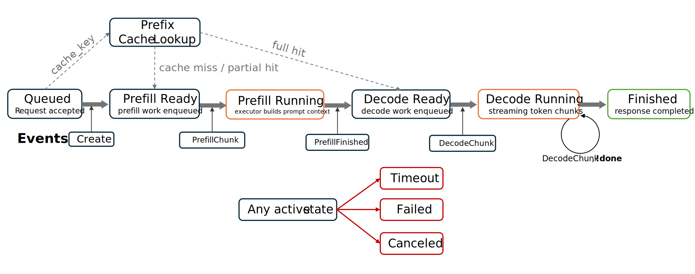
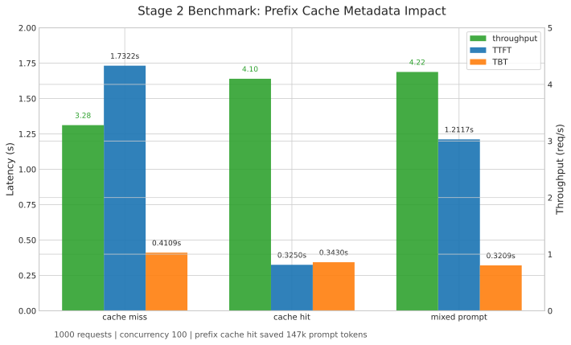

# Stage 2 总结

[English Version](./stage2_en.md)

## 概述

Stage 2 将 `mini-llm-serve` 从 Stage 1 的 request-level batching 系统，推进成了一个更接近 LLM serving 语义的调度实验系统。

Stage 1 的核心对象是“请求”。请求进入 FIFO 队列后被组成 batch，再交给 Python mock executor 执行。这个模型足以验证 serving 主链路，但它无法表达 LLM 推理中最重要的差异：prefill 和 decode 的成本不同，prompt 长度会影响调度压力，streaming 的首 token 延迟和后续 token 间隔需要分开观察，prefix cache 会改变 prefill 成本。

Stage 2 的核心变化是引入 LLM-aware 的内部模型。系统开始显式区分 `Request`、`WorkItem` 和 `Event`：

- `Request` 表示一个用户请求的完整生命周期和状态机。
- `WorkItem` 表示一次具体可调度的执行任务，可以是 prefill，也可以是 decode。
- `Event` 表示 executor 返回的执行结果，并驱动状态机继续推进。

这个拆分让系统从“批处理请求”变成“调度 token-aware work”，也让 prefill/decode separation、token budget scheduler、streaming metrics 和 prefix cache metadata 可以自然接入。

## 关键结论

- Stage 2 已经建立了显式的 prefill / decode 执行模型。
- 调度器不再只按请求数量打包，而是引入了 token budget 约束。
- 请求生命周期由状态机管理，executor 返回的事件会驱动下一个 `WorkItem` 生成。
- streaming 路径已经具备 TTFT 和 TBT 指标，能区分首 token 延迟和后续 token 间隔。
- prefix cache metadata 可以影响 prefill 成本，并在 benchmark 中显著降低 TTFT。
- 当前系统仍然是 mock inference，不包含真实 KV cache、PagedAttention 或 GPU kernel。

## 架构变化

Stage 2 保留了 Go control plane 与 Python mock executor 的分层，但改变了 Go 侧的核心抽象。


Stage 1 中，请求进入队列后基本作为一个整体被调度。Stage 2 中，请求先被 `RequestLifecycleStateManager` 接管，然后被拆成可执行的 `WorkItem`：

```text
GenerateRequest
  -> Request
  -> initial WorkItem
  -> Scheduler
  -> ExecutorManager
  -> Python Mock Executor
  -> Event
  -> RequestLifecycleStateManager
  -> next WorkItem or final response
```

这个循环是 Stage 2 的核心。调度器不再直接决定请求什么时候结束，而是负责选择下一批可执行 work。请求是否继续 prefill、进入 decode、继续 decode 或结束，由状态机根据 executor event 推进。

这种设计把三个职责拆开了：

- handler / transport 负责接收请求和返回响应。
- scheduler 负责按 token budget 选择 work。
- state manager 负责请求生命周期和事件推进。

## 请求生命周期

Stage 2 中的请求生命周期可以理解为下面这条状态链：



```text
queued
  -> prefill ready
  -> prefill running
  -> decode ready
  -> decode running
  -> finished
```

异常路径包括：

```text
timeout
canceled
failed
```

请求创建时，系统会估算 prompt token 数，并根据 prefix cache metadata 判断是否已有可复用前缀。如果没有 cache hit，请求会先生成 prefill work。如果 cache 命中并覆盖完整 prompt，则可以直接生成 decode work。

prefill 完成后，状态机会写入 prefix cache metadata，并生成第一个 decode work。每个 decode event 会更新已生成 token 数，并决定请求是继续 decode，还是因为 stop / length / error 结束。

这个模型的价值在于，它把 LLM 推理的阶段性暴露给了 serving 系统。系统不再只知道“请求还没结束”，而是能知道请求正在 prefill、正在 decode、是否已经输出首 token，以及是否可以继续生成下一步 decode work。

## Prefill / Decode Separation

Stage 2 将 prefill 和 decode 建模成不同类型的 work。

prefill work 的成本来自 prompt token 数。它代表模型读取 prompt 并建立上下文的过程，在真实系统中通常更偏 compute-heavy。decode work 当前每次生成一个 token，在真实系统中通常更 latency-sensitive，并且会反复进入调度器。

这种拆分直接带来两个能力：

- 调度器可以优先考虑 decode，避免 streaming 请求长期等待。
- benchmark 可以分别观察 TTFT 和 TBT，而不是只看端到端 latency。

当前实现中，decode 仍然是每次一个 token。这使系统行为更容易观察，但也会放大调度器和 executor RPC 的往返成本。后续可以单独做 multi-token decode chunk 实验。

## Token Budget Scheduler

Stage 1 的 batch 主要由 request count 和 timeout 控制。Stage 2 的调度器开始引入 token budget。

调度器在每一轮选择 batch 时，会同时考虑：

- `maxBatchSeqs`：一次 batch 中最多包含多少条 work item。
- `maxBatchTokens`：一次 batch 中最多消耗多少 token budget。
- decode work：当前按 1 个 token 成本计算。
- prefill work：按本轮需要 prefill 的 token 数计算。
- small / large prefill queue：按 prompt token 阈值区分不同 prefill 压力。
- partial prefill：当 large prefill 超过剩余 budget 时，可以切出一个 prefill chunk。

这个模型比纯 FIFO 更贴近真实 serving 系统，因为它开始承认“一个请求”和“一个请求的执行成本”不是同一个东西。

在当前实现中，scheduler 会先取 decode work。如果没有 decode 压力，则会放宽 prefill 限制，让 batch 尽量装满 prefill work。这个策略保留了 streaming 优先级，同时避免系统只有 prefill 时 batch 利用率太低。

## Streaming 与 TTFT / TBT

Stage 2 增加了 streaming 相关的观测指标：

- `TTFT`，time to first token，表示请求到达到第一个 token 输出之间的时间。
- `TBT`，time between tokens，表示连续 token chunk 之间的间隔。

这两个指标必须分开看，因为它们对应不同的系统原因：

- TTFT 主要受排队、prefill、prefix cache 命中情况影响。
- TBT 主要受 decode 调度、executor 执行、事件回流和 streaming 发送路径影响。

如果只看端到端 latency，会把 prefill 和 decode 的问题混在一起。Stage 2 的指标让系统可以回答更具体的问题：是首 token 慢，还是后续 token 慢。

## Prefix Cache Metadata

Stage 2 没有实现真实 KV cache，也没有实现 PagedAttention。当前实现的是 prefix cache metadata。

它的作用是记录某个 `cache_key` 已经完成过多少 prompt tokens 的 prefill。当新请求携带相同 `cache_key` 时，状态机会查 cache，并把已缓存 token 数计入 `ComputedTokens`。

如果 cache 覆盖了完整 prompt，请求可以跳过 prefill，直接进入 decode。如果只命中部分 token，则只为剩余 token 生成 prefill work。

这不是 GPU KV cache 管理，但它表达了 cache-aware scheduling 最关键的控制面语义：

- cache hit 会降低 prefill 成本。
- cache hit 会降低 TTFT。
- cache hit / miss 可以通过 metrics 观测。
- cache saved tokens 可以量化 prefix cache 的收益。

## Benchmark 结果

Stage 2 benchmark 使用三个场景：



- `cache_miss`：所有请求使用唯一 cache key。
- `cache_hit`：先 warmup 一个请求建立 shared prefix cache，再正式压测。
- `mixed_prompt`：混合 short / medium / long prompt，且全部 cache miss。

核心结果如下：

| Mode | Throughput (req/s) | Avg Latency | Avg TTFT (s) | Avg TBT (s) | Prefix Hits | Prefix Misses | Tokens Saved |
|---|---:|---:|---:|---:|---:|---:|---:|
| `cache_miss` | 3.28 | 30.502s | 1.7322 | 0.4109 | 0 | 1000 | 0 |
| `cache_hit` | 4.10 | 24.341s | 0.3250 | 0.3430 | 1000 | 0 | 147000 |
| `mixed_prompt` | 4.22 | 23.682s | 1.2117 | 0.3209 | 0 | 1000 | 0 |

最重要的结论是：prefix cache metadata 明显降低了 TTFT。相比 `cache_miss`，`cache_hit` 的平均 TTFT 从 `1.7322s` 降到 `0.3250s`，降幅约 `81%`。

更详细的 benchmark 表格和解释见 [Stage 2 Benchmark Notes](../benchmarks/stage2_zh.md)。

## 局限

Stage 2 仍然有明确边界：

- executor 是 Python mock executor，不是真实模型推理。
- prefix cache 是 metadata，不是真实 KV block cache。
- 没有实现 PagedAttention、FlashAttention 或 GPU memory allocator。
- decode 当前每次只生成一个 token，会放大调度和 RPC 往返成本。
- batch metrics 当前主要以 mixed batch 视角观测，后续可以继续细分 prefill / decode batch 指标。

这些限制是刻意保留的。Stage 2 的目标不是复制 vLLM，而是在一个可读、可运行的 Go serving 系统中建立 LLM-aware scheduling 的核心控制面模型。

## Stage 2 总结

Stage 2 完成后，`mini-llm-serve` 已经不再只是一个 dynamic batching demo。

它现在具备了一个最小 LLM serving control plane 所需要的关键抽象：

- 请求生命周期状态机
- prefill / decode separation
- token budget scheduler
- streaming 输出与 TTFT / TBT 指标
- prefix cache metadata
- executor manager 与事件驱动回流
- 可复现 benchmark 与系统行为分析

下一阶段最有价值的方向不是继续堆功能，而是沿着两个方向深化：

- 在本地或 Kubernetes 环境中运行完整服务，补齐部署、路由和生产系统视角。
- 在 decode 侧做 multi-token chunk 实验，观察 TBT、latency 和 throughput 的变化。
